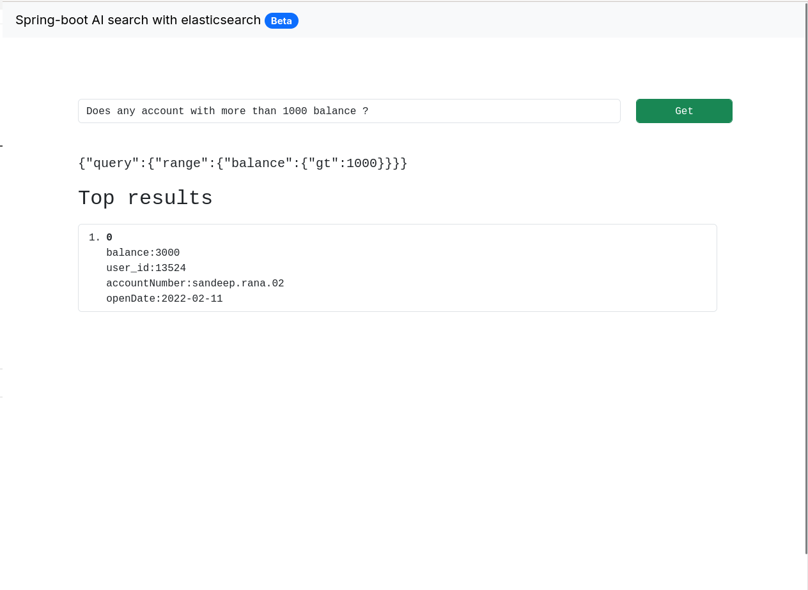
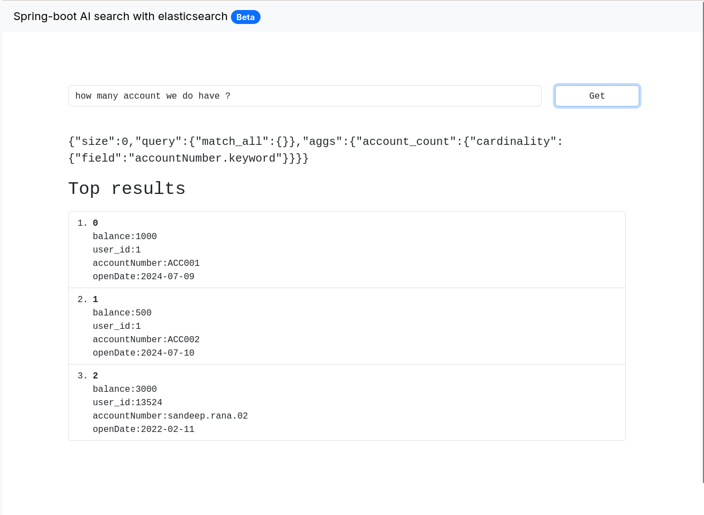

# Getting Started
### Spring AI
**Generate the elasticsearch query and search based on defined data.**

### Prerequisite 

#### Elasticsearch 8.13.3 or above
1. Deploy elasticsearch in docker
    ```
    docker run -d --name elasticsearch -p 9200:9200 -p 9300:9300 -e "discovery.type=single-node" -e "xpack.security.enabled=false" elasticsearch:8.13.3
    ```
2. Create an index with below mapping and setting
```
PUT http://localhost:9200/account-documents
   {
    "mappings": {
        "properties": {
            "accountNumber": {
                "type": "text",
                "fields": {
                    "keyword": {
                        "type": "keyword",
                        "ignore_above": 256
                    }
                }
            },
            "balance": {
                "type": "float"
            },
            "openDate": {
                "type": "date"
            },
            "user_id": {
                "type": "long"
            }
        }
    },
    "settings": {
        "index": {
            "routing": {
                "allocation": {
                    "include": {
                        "_tier_preference": "data_content"
                    }
                }
            },
            "number_of_shards": "1",
            "number_of_replicas": "1"
        }
    }
  }
````

3. Insert the document as mentioned below
```
POST http://localhost:9200/account-documents/_doc
{
    "accountNumber": "sandeep.rana.02",
    "user_id": 13524,
    "balance": 1000.00,
    "openDate": "2022-02-11"
}
```


### Setup and build 
Change the application.properties file based on your prop.
```
spring.ai.mistralai.api-key=<api-key>
```
### Build the project
1. Run ```mvn clean install```
2. Run ```mvn spring-boot:start```

### Testing result and input 
**Open the [browser](http://localhost:8091/ui/index.html)**

Use the below as sample to search

1. Does any account with more than 1000 balance ?

2. how many account we do have ?



### Reference Documentation
For further reference, please consider the following sections:

* [Official Apache Maven documentation](https://maven.apache.org/guides/index.html)
* [Spring Boot Maven Plugin Reference Guide](https://docs.spring.io/spring-boot/3.3.3/maven-plugin)
* [Create an OCI image](https://docs.spring.io/spring-boot/3.3.3/maven-plugin/build-image.html)
* [Spring Web](https://docs.spring.io/spring-boot/docs/3.3.3/reference/htmlsingle/index.html#web)
* [OpenAI](https://docs.spring.io/spring-ai/reference/api/clients/openai-chat.html)
* [Elasticsearch Vector Database](https://docs.spring.io/spring-ai/reference/api/vectordbs/elasticsearch.html)
* [Spring Data JPA](https://docs.spring.io/spring-boot/docs/3.3.3/reference/htmlsingle/index.html#data.sql.jpa-and-spring-data)

### Guides
The following guides illustrate how to use some features concretely:

* [Building a RESTful Web Service](https://spring.io/guides/gs/rest-service/)
* [Serving Web Content with Spring MVC](https://spring.io/guides/gs/serving-web-content/)
* [Building REST services with Spring](https://spring.io/guides/tutorials/rest/)
* [Accessing Data with JPA](https://spring.io/guides/gs/accessing-data-jpa/)

### Maven Parent overrides

Due to Maven's design, elements are inherited from the parent POM to the project POM.
While most of the inheritance is fine, it also inherits unwanted elements like `<license>` and `<developers>` from the parent.
To prevent this, the project POM contains empty overrides for these elements.
If you manually switch to a different parent and actually want the inheritance, you need to remove those overrides.

